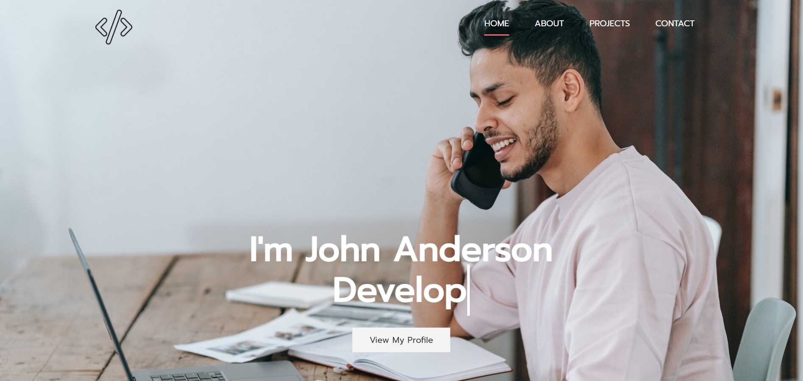

# Udemy - Komple Uygulamalı Web Geliştirme Eğitimi 
## Html - Css Bölüm Sonu Çalışması

Tasarım Görseli



## About Project
Bu repo, [Udemy / Sadık Turan - (120+ Saat) Komple Uygulamalı Web Geliştirme Eğitiminde](https://www.udemy.com/course/komple-web-developer-kursu/) oluşturduğum html ve css bölüm sonu çalışmam.

Projemde Html,css ve scss çalışmaları vardır.

## Installation
Projeyi klonlayarak kullanabilirsiniz. 
```
https://github.com/aybarsumur/freelancer-website-scss.git
```